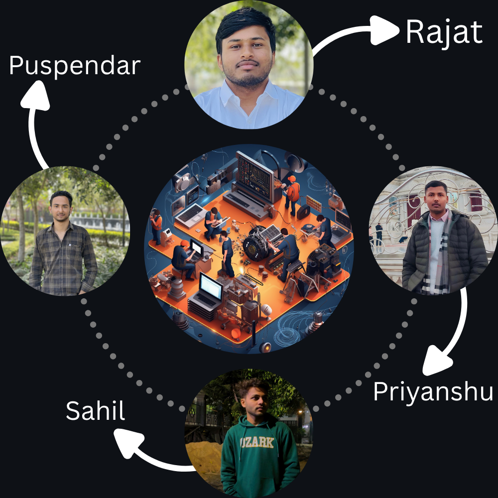

<!-- HEADER -->
<div align="center">


</div>

<div align="center">

<br/>

[](https://reactjs.org/)
[](https://tailwindcss.com/)
[](#)
[](LICENSE)
[](https://github.com/yourusername/notecraft)

<br/>

```
📝 Create Notes  •  🤖 Multi-Model AI Tutor  •  📅 Task Manager  •  📈 Progress Tracker
```

</div>

---

## 🌟 What is NoteCraft?

<div align="center">

> **AI Powered NoteCraft** is a next-gen productivity suite built *specifically* for students —  
> combining intelligent note-taking, an AI tutor, task scheduling, and progress analytics  
> into one beautiful, distraction-free workspace.

</div>

<br/>

<table align="center">
<tr>
<td align="center" width="180">
<br/>

<br/><b>Smart Notes</b>
<br/><sub>Create, organize & search notes effortlessly</sub>
<br/><br/>
</td>
<td align="center" width="180">
<br/>

<br/><b>Multi-Model AI</b>
<br/><sub>Multiple AI models for every learning style</sub>
<br/><br/>
</td>
<td align="center" width="180">
<br/>

<br/><b>Task Manager</b>
<br/><sub>Schedule, prioritize & track daily tasks</sub>
<br/><br/>
</td>
<td align="center" width="180">
<br/>

<br/><b>Progress Analytics</b>
<br/><sub>Beautiful charts to visualize your growth</sub>
<br/><br/>
</td>
</tr>
</table>


---

## 👨‍💻 Team

<div align="center">

### 🏆 Team Leader

<table>
<tr>
<td align="center">
<b>Rajat</b><br/>
<sub><code>2400290120197</code></sub>
</td>
</tr>
</table>

### 🤝 Contributors

<table>
<tr>
<td align="center"><b>Priyanshu Tewatiya</b><br/><sub><code>2400290120194</code></sub></td>
<td align="center"><b>Puspendar Chauhan</b><br/><sub><code>2400290120195</code></sub></td>
<td align="center"><b>Sahil Kumar</b><br/><sub><code>2400290120215</code></sub></td>
</tr>
</table>

<br/>



</div>

---

---


## ✨ Features

<div align="center">

| Feature | Description |
|--------|-------------|
| 📝 **Smart Notes** | Create and organize notes with a sleek rich-text editor |
| 🤖 **AI Tutor** | Access multiple AI models to solve academic questions instantly |
| 📥 **Save AI Answers** | Save any AI response directly into your notes with one click |
| 📅 **Task Scheduler** | Manage daily tasks, set priorities, and never miss a deadline |
| 📈 **Progress Tracker** | Visualize your study habits and streaks with interactive charts |
| 🌙 **Premium Dark UI** | Smooth, eye-friendly dark interface crafted for long study sessions |
| ⚡ **Focus Mode** | Distraction-free environment to maximize concentration |

</div>

---

## 🛠️ Tech Stack

<div align="center">

| Layer | Technology |
|-------|-----------|
| ⚛️ **Frontend** | React.js |
| 🎨 **Styling** | Tailwind CSS |
| 🌌 **Animations** | Modern CSS Animations |
| 📊 **Charts** | Recharts Library |
| 🤖 **Intelligence** | Multi-Model AI Integration |

</div>

---

## 🚀 Future Roadmap

<div align="center">

```
🎤 Voice Notes           ─────── In Planning
☁️  Cloud Sync            ─────── In Planning
👥 Team Collaboration    ─────── Upcoming
🧠 AI Summary Generator  ─────── Upcoming
📱 Mobile App            ─────── Upcoming
🌍 Multi-language        ─────── Future
```

</div>


<!-- FOOTER -->
<div align="center">


<br/>

**⭐ If NoteCraft helps your studies, give it a star — it means a lot to us!**

<br/>

*Built with 💜 by Team NoteCraft*

</div>